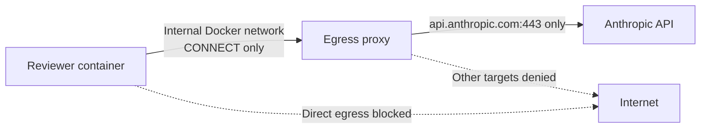

# Restricted Reviewer Network Egress

English | [中文](reviewer-egress.md)

Status: `implemented_tested_not_active_not_authorized`

This implementation provides a proxy-only network egress foundation for a future Claude reviewer. It is not connected to the current runner, injects no credential, invokes no model, and does not authorize a formal assessment. The current runner continues to use `--network none`.

## Network boundary



The smoke test creates two temporary networks:

- the reviewer joins only an `--internal` network with no external default route;
- the egress proxy joins both the internal network and a normal outbound network;
- the proxy publishes no host port;
- the reviewer can request CONNECT only through the internal `egress-proxy:3128` alias;
- proxy code permits only the exact `api.anthropic.com:443` target, and environment variables cannot override it.

The allowed target is resolved to IPv4 first. Private, loopback, link-local, documentation, and other non-public ranges are rejected. The proxy connects to the selected resolved address, after which the client verifies TLS using `api.anthropic.com` as the SNI and certificate name. The current implementation supports public IPv4 only and fails closed when no eligible address resolves.

## Logging and data boundary

The proxy logs only JSON connection decisions: time, `allow` or `deny`, normalized target, and a fixed reason. It does not log CONNECT headers, authentication material, request bodies, or model content inside TLS. The proxy does not terminate TLS and therefore cannot see encrypted API requests.

This also means the proxy constrains only the host and port. It cannot determine the request type, model, token count, or cost inside the tunnel. A future Claude command, credential policy, and post-run evidence must enforce model and budget limits separately.

## Image and process restrictions

`reviewer/egress/` uses the same digest-pinned Node base image as the reviewer runtime. The proxy runs as UID/GID `10002:10002` with a read-only root filesystem, all Linux capabilities dropped, `no-new-privileges`, resource limits, and a restricted `/tmp` tmpfs.

An allowlist-style `.dockerignore` limits the build context. The proxy exposes no shell execution interface, configuration write interface, or dynamic allowlist API.

## Verification

Run:

```text
python -m scripts.reviewer_egress_smoke
```

The smoke test uses the built reviewer image as its probe and verifies:

| Check | Expected and verified result |
| --- | --- |
| `api.anthropic.com:443` through the proxy | CONNECT 200 and successful TLS certificate verification; no HTTP/API request is sent through the TLS tunnel to Anthropic |
| `example.com:443` through the proxy | CONNECT 403 |
| Direct reviewer connection to `api.anthropic.com:443` | Connection fails |
| Log redaction | The synthetic header sentinel, header names, and contents do not enter proxy logs |
| Temporary resources | The container and both test networks are removed after success or failure |

Results are written under the Git-ignored `.local/reviewer-egress/`. The most recent local proxy image ID was `sha256:dc4b0704ba84407d472ae93dd04dc01f80bbf2fb4f16d2adf12c93d1518ae235`; formal use must still record an immutable registry digest.

## Gates not yet complete

- The current reviewer Docker plan does not enable this proxy and remains on `--network none`.
- API key, OAuth, or another formal authentication method has not been selected.
- No real Claude session has verified that managed settings load or that Claude uses only the proxy.
- Model, input/output token, tool-call, and spending budgets are not implemented.
- Additional Anthropic hosts needed for OAuth are outside the allowlist; every added host requires separate review and testing.
- Before formal execution, reviewer and proxy images must use immutable registry digests, and the exact network, credential, and budget must be bound to a human approval record.
