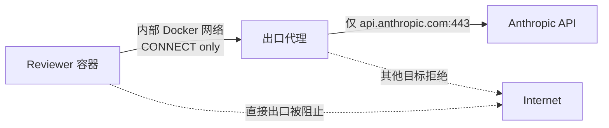

# Reviewer 受限网络出口

[English](reviewer-egress.en.md) | 中文

状态：`implemented_tested_not_active_not_authorized`

本实现为未来 Claude reviewer 提供代理唯一的网络出口基础。它没有接入当前 runner、没有注入凭据、没有调用模型，也没有授权正式评估。当前 runner 继续使用 `--network none`。

## 网络边界



Smoke test 创建两个临时网络：

- reviewer 只加入 `--internal` 网络，该网络没有外部默认路由；
- 出口代理同时加入内部网络和普通 outbound 网络；
- 代理不向宿主机发布端口；
- reviewer 只能通过内部别名 `egress-proxy:3128` 请求 CONNECT；
- 代理代码只允许精确目标 `api.anthropic.com:443`，该目标不能通过环境变量覆盖。

允许目标先解析为 IPv4，并拒绝私有、loopback、link-local、文档保留地址和其他非公网范围。代理连接固定解析结果，客户端随后以 `api.anthropic.com` 作为 SNI 和证书名称完成 TLS 验证。当前实现只支持公网 IPv4；解析不到合格地址时失败关闭。

## 日志与数据边界

代理只记录 JSON 连接决策：时间、`allow`/`deny`、规范化目标和固定原因。它不记录 CONNECT headers、认证信息、请求正文或 TLS 内的模型内容。代理不终止 TLS，因此看不到加密后的 API 请求。

这也意味着代理只能约束主机和端口，不能判断隧道中的请求类型、模型、token 数或费用。模型与预算限制必须由未来的 Claude 命令、凭据策略和调用后证据单独控制。

## 镜像和进程限制

`reviewer/egress/` 使用与 reviewer runtime 相同、按摘要固定的 Node 基础镜像。代理以 UID/GID `10002:10002` 运行，并使用只读根文件系统、删除全部 Linux capabilities、`no-new-privileges`、资源限制和受限 `/tmp` tmpfs。

构建上下文由 `.dockerignore` allowlist 限制。代理没有 shell 执行接口、配置写入接口或动态 allowlist API。

## 验证

运行：

```text
python -m scripts.reviewer_egress_smoke
```

Smoke test 使用已构建的 reviewer 镜像作为探针，并验证：

| 检查 | 预期与已验证结果 |
| --- | --- |
| `api.anthropic.com:443` 经代理 | CONNECT 200，TLS 证书验证成功；未在 TLS 隧道内向 Anthropic 发送 HTTP/API 请求 |
| `example.com:443` 经代理 | CONNECT 403 |
| reviewer 直连 `api.anthropic.com:443` | 连接失败 |
| 日志脱敏 | 人工测试 header 的 sentinel、header 名和内容均未进入代理日志 |
| 临时资源 | 容器与两个测试网络在成功或失败后清理 |

结果写入 Git 忽略的 `.local/reviewer-egress/`。最近验证的本地代理镜像 ID 为 `sha256:dc4b0704ba84407d472ae93dd04dc01f80bbf2fb4f16d2adf12c93d1518ae235`；正式使用前仍须记录不可变 registry digest。

## 尚未完成的门禁

- 当前 reviewer Docker plan 没有启用该代理，仍为 `--network none`。
- 尚未选择 API key、OAuth 或其他正式认证方式。
- 尚未验证真实 Claude 会话读取 managed settings 或只使用代理。
- 尚未实现模型、输入/输出 token、工具调用次数和费用预算。
- OAuth 流程所需的其他 Anthropic 主机不在 allowlist；任何新增主机都需要单独审核和测试。
- 正式运行前必须把 reviewer 与代理镜像改为不可变 registry digest，并把准确网络、凭据和预算绑定到人工批准记录。
