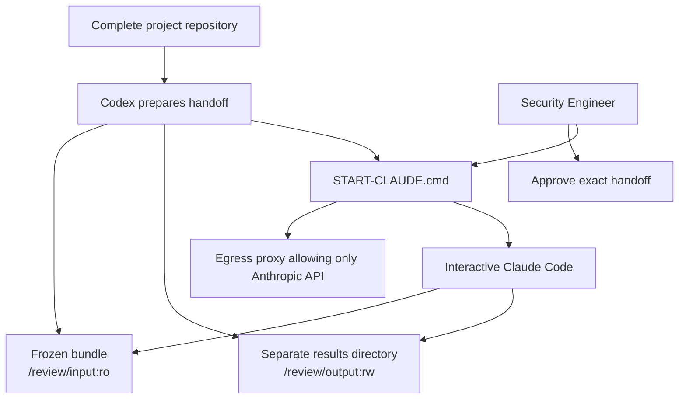

# Interactive Static-only Claude Reviewer

English | [中文](reviewer-execution.md)

Status: `interactive_static_review_handoff_preparer`

This layer only prepares the isolated workspace. Neither Codex nor project code launches Claude, reads the API key, or invokes a model. The Security Engineer runs the generated `START-CLAUDE.cmd` in Windows Terminal to enter interactive Claude Code inside the reviewer container.

## Invocation path



## Static-only boundary

Claude's working directory is fixed at `/review/input`. Its only tools are `Read`, `Glob`, `Grep`, and `Write` restricted to `/review/output`. `Bash`, `Edit`, Web, MCP, browsers, application startup, and HTTP testing are prohibited.

The source repository, parent directories, SQLite database, application tokens, operator scenario truth, and historical reports are not mounted. The reviewer uses a non-root UID, read-only root filesystem, dropped capabilities, `no-new-privileges`, resource limits, and temporary Claude configuration. It has no direct Internet egress. The separate proxy permits only `api.anthropic.com:443`.

## Input and output

The current repaired workspace is `.local/reviewer-handoffs/appsec-v1-phase1-ready-v4/`. Its `input/` contains the copied frozen bundle, while results persist in the separate host directory `.local/reviewer-results/appsec-v1-phase1-ready-v4/`.

Claude must produce:

- `static-review-log.json`
- `findings.json`
- `findings.md` and `findings.en.md`
- `remediation-advice.md` and `remediation-advice.en.md`
- `limitations.md` and `limitations.en.md`

Findings and remediation advice are drafts for Security Engineer review. Claude does not modify application code or make the final finding or severity decision.

## One command to enter Claude

After formal approval, run this in Windows Terminal:

```text
.local\reviewer-handoffs\appsec-v1-phase1-ready-v4\START-CLAUDE.cmd "C:\secure\anthropic-api-key.txt"
```

The argument is the repository-external key-file path. The batch file checks only that the file exists and passes its path to Docker secrets; it does not read or print the key value. It builds the images, starts the egress proxy, enters interactive Claude, and cleans up containers and networks after exit while retaining the results directory.

The interactive CLI does not provide `--max-budget-usd` or `--max-turns` hard stops. The current hard stop is the outer 900-second container timeout. Cost control relies on the approved dedicated Workspace spend limit and mandatory post-run usage reconciliation.
