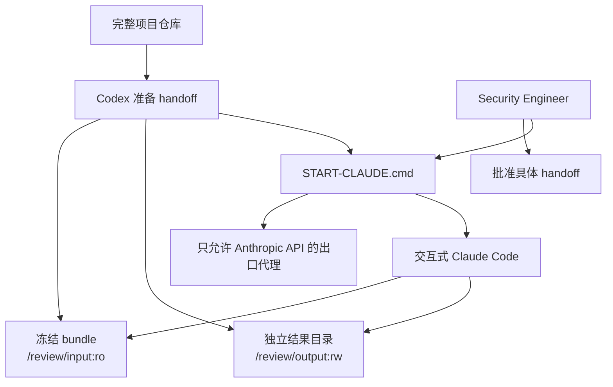

# 交互式 Static-only Claude Reviewer

[English](reviewer-execution.en.md) | 中文

状态：`interactive_static_review_handoff_preparer`

本层只准备隔离 workspace。Codex 和项目代码不启动 Claude、不读取 API key，也不调用模型。Security Engineer 在 Windows Terminal 中运行生成的 `START-CLAUDE.cmd`，由该命令进入 reviewer 容器内的交互式 Claude Code。

## 调用关系



## Static-only 边界

Claude 的当前目录固定为 `/review/input`。允许的工具只有 `Read`、`Glob`、`Grep` 和仅能写入 `/review/output` 的 `Write`。`Bash`、`Edit`、Web、MCP、浏览器、应用启动和 HTTP 测试全部禁止。

源仓库、父目录、SQLite、应用 token、操作者 scenario truth 和历史报告都不挂载。Reviewer 使用非 root UID、只读根文件系统、删除 capabilities、`no-new-privileges`、资源限制和临时 Claude 配置目录。它没有直接互联网出口；独立代理只允许 `api.anthropic.com:443`。

## 输入与输出

当前修复后的 workspace 位于 `.local/reviewer-handoffs/appsec-v1-phase1-ready-v4/`。冻结 bundle 复制到其中的 `input/`，但结果保存在另一个宿主目录 `.local/reviewer-results/appsec-v1-phase1-ready-v4/`。

Claude 必须生成：

- `static-review-log.json`
- `findings.json`
- `findings.md` 与 `findings.en.md`
- `remediation-advice.md` 与 `remediation-advice.en.md`
- `limitations.md` 与 `limitations.en.md`

Finding 和 remediation advice 都是供 Security Engineer 判断的草稿。Claude 不修改应用代码，也不最终确认 finding 或严重性。

## 一条命令进入 Claude

正式批准后，在 Windows Terminal 中运行：

```text
.local\reviewer-handoffs\appsec-v1-phase1-ready-v4\START-CLAUDE.cmd "C:\secure\anthropic-api-key.txt"
```

参数是仓库外 key 文件的路径。批处理只检查文件存在并把路径交给 Docker secret，不读取或打印 key 内容。它构建镜像、启动出口代理、进入交互式 Claude，并在退出后清理容器和网络；结果目录保留。

交互 CLI 没有 `--max-budget-usd` 或 `--max-turns` 硬停止能力。当前硬停止是容器外层 900 秒 timeout；费用边界依赖已批准的专用 Workspace spend limit，并要求运行后核对 usage。
